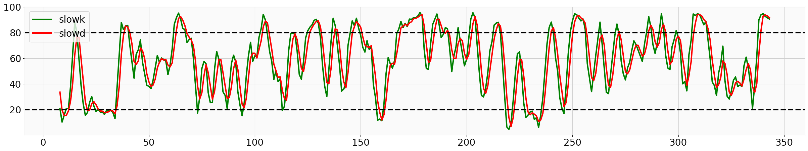

# flask_technical_analysys for actions

to use it:

```
pip install requests_html
C:/Python38/python.exe -m pip install -r .\requirements.txt
C:/Python38/python.exe .\app.py
```
and open in the browser
http://127.0.0.1:5000/api/ta?ticker=AMD&indicator=adx

to see the options go to
http://127.0.0.1:5000

based on the library:
pandas-ta
    https://github.com/twopirllc/pandas-ta

notebook
    https://github.com/tomasmerencio/AnalisisTecnicoAcciones/blob/master/AnalisisTecnicoAcciones.ipynb


## Indicador Estocástico
-   STOCH
    - slowd
      - green
    - slowk
      - red
<!--



-->

<p align="center">
  
</p>

### stoch response example
```
{
  "date": [
    "2020/09/04", 
    "2020/09/08", 
    "2020/09/09", 
    "2020/09/10", 
    "2020/09/11", 
    "2020/09/14", 
    "2020/09/15", 
    "2020/09/16", 
    "2020/09/17", 
    "2020/09/18", 
    "2020/09/21", 
    "2020/09/22", 
    "2020/09/23", 
    "2020/09/24", 
    "2020/09/25"
  ], 
  "name": "Advanced Micro Devices, Inc.", 
  "stoch": {
    "slowd": [
      61.31325194047465, 
      53.43169105954146, 
      42.67945269775044, 
      30.965750910899104, 
      24.290898733473593, 
      22.09009743922211, 
      24.973210828113242, 
      26.6619974020666, 
      29.255320789064758, 
      29.773519576939652, 
      32.960512458069694, 
      36.283687936644306, 
      39.3043266779309, 
      40.52549640083082, 
      44.44300422892409
    ], 
    "slowk": [
      56.17958316229338, 
      42.346524809907336, 
      29.51225012105018, 
      21.038477801739365, 
      22.321968277630805, 
      22.909846238295735, 
      29.687817968412766, 
      27.388327999490865, 
      30.68981639929022, 
      31.24241433203744, 
      36.949306642880984, 
      40.65934283501407, 
      40.30433055589724, 
      40.61281581158074, 
      52.411866319293914
    ]
  }, 
  "ticker": "AMD"
}
```


## Índice de movimiento direccional (DMI)
-   ADX
    - ADX
      - purple
    - DI+
      - green
    - DI-
      - red


<p align="center">
  
</p>


### adx response example
```
{
  "adx": {
    "adx": [
      34.95320400861142, 
      32.97557212098038, 
      31.139199668399314, 
      29.28301131496151, 
      27.782851295428735, 
      27.152829244357576, 
      26.5678087717984, 
      25.535557832707102, 
      24.5770391084043, 
      24.275403891222822, 
      23.71893313864097, 
      22.990736639847327, 
      22.016000340815843, 
      21.392842269546477, 
      20.948615497412952
    ], 
    "di_minus": [
      23.191902015371177, 
      28.83408498289219, 
      26.90099581831011, 
      25.199580382247152, 
      24.628884017111485, 
      28.125706454215766, 
      26.90283081649776, 
      24.91588148837799, 
      23.549726494605824, 
      26.67625954512641, 
      24.980379049701185, 
      23.149919029935162, 
      21.681044199349262, 
      21.964222829949243, 
      21.42145102513345
    ], 
    "di_plus": [
      28.788667063997664, 
      24.92757009083814, 
      23.25638074425232, 
      22.729979191841014, 
      20.861896250845668, 
      19.159272097167825, 
      18.326247436181042, 
      19.530612645187936, 
      18.45973566220425, 
      17.65334668636745, 
      17.909982851636336, 
      17.634200331463557, 
      17.97537806606281, 
      16.81038441750229, 
      15.777070953220768
    ]
  }, 
  "date": [
    "2020/09/03", 
    "2020/09/04", 
    "2020/09/08", 
    "2020/09/09", 
    "2020/09/10", 
    "2020/09/11", 
    "2020/09/14", 
    "2020/09/15", 
    "2020/09/16", 
    "2020/09/17", 
    "2020/09/18", 
    "2020/09/21", 
    "2020/09/22", 
    "2020/09/23", 
    "2020/09/24"
  ], 
  "name": "Advanced Micro Devices, Inc.", 
  "ticker": "AMD"
}

```


## Bollinger Bands
-   BBANDS
    - upperband
      - green
    - middleband
      - lightblue
    - lowerband
      - yellow
    - price
      - blue


<p align="center">
  
</p>

### bbands response example
```
{
  "bbands": {
    "lower": [
      77.80462679912686, 
      73.57262831420282, 
      74.5266690413792, 
      77.1538215002322, 
      74.79190493490863, 
      74.69315889258966, 
      74.73986164746434, 
      75.2915169442867, 
      75.06066334395571, 
      73.97113598892352, 
      73.96696007062658, 
      74.37295345498278, 
      73.36510708657012, 
      73.19201954733003, 
      73.93104532498364
    ], 
    "mid": [
      87.55400085449219, 
      85.1280014038086, 
      83.07400207519531, 
      80.82600250244141, 
      79.58600158691407, 
      78.76400146484374, 
      78.81200103759765, 
      77.76200103759766, 
      77.2760009765625, 
      76.99400177001954, 
      77.002001953125, 
      76.75600128173828, 
      76.37000122070313, 
      76.2240005493164, 
      76.76000061035157
    ], 
    "upper": [
      97.30337490985751, 
      96.68337449341438, 
      91.62133510901143, 
      84.49818350465063, 
      84.3800982389195, 
      82.83484403709782, 
      82.88414042773097, 
      80.23248513090861, 
      79.49133860916929, 
      80.01686755111555, 
      80.03704383562342, 
      79.13904910849378, 
      79.37489535483614, 
      79.25598155130277, 
      79.5889558957195
    ]
  }, 
  "date": [
    "2020/09/04", 
    "2020/09/08", 
    "2020/09/09", 
    "2020/09/10", 
    "2020/09/11", 
    "2020/09/14", 
    "2020/09/15", 
    "2020/09/16", 
    "2020/09/17", 
    "2020/09/18", 
    "2020/09/21", 
    "2020/09/22", 
    "2020/09/23", 
    "2020/09/24", 
    "2020/09/25"
  ], 
  "name": "Advanced Micro Devices, Inc.", 
  "ticker": "AMD"
}

```


## Average True Range (ATR)
-   ATR
    - price
      - yellow


<p align="center">
  
</p>
